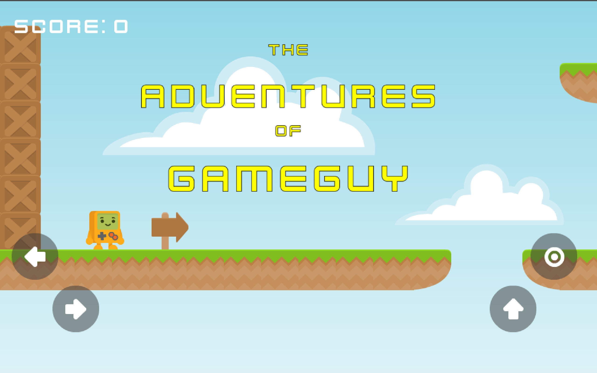
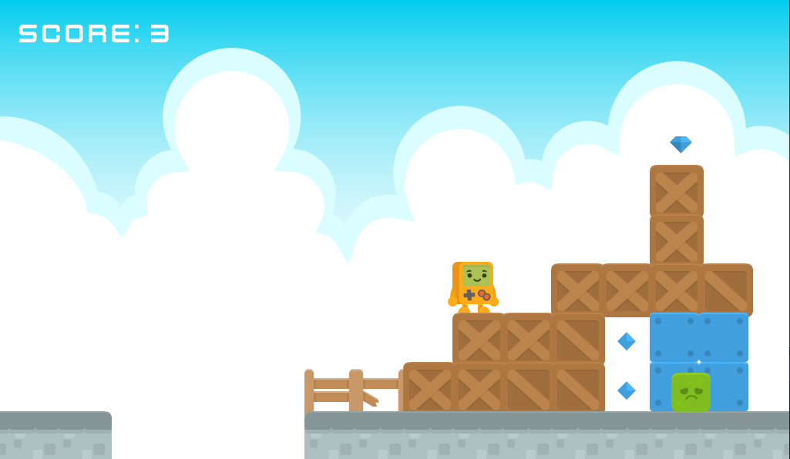
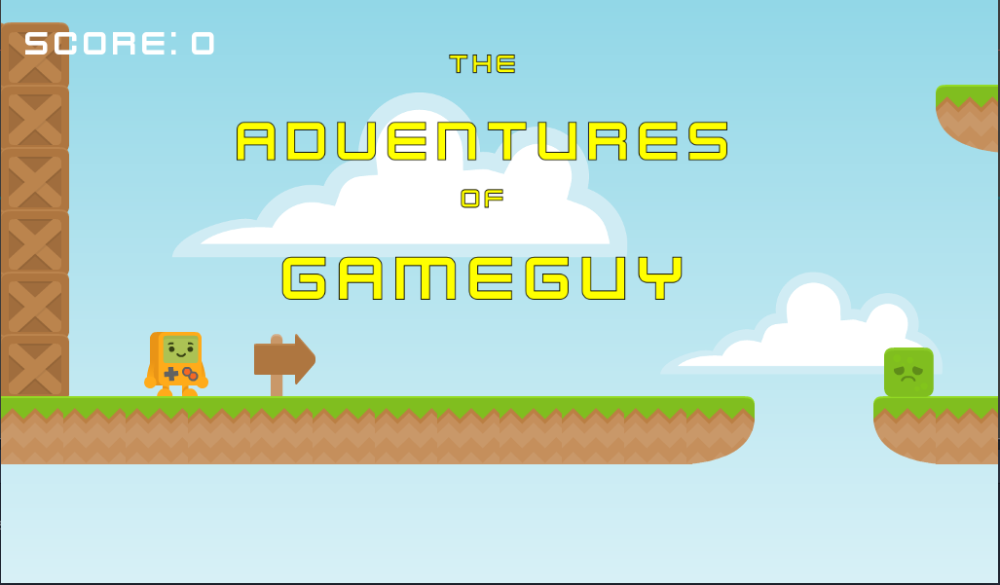

# Gameguy 2D Scroller

A 2D scroller game built with [Godot Engine 3.1](https://godotengine.org/)

Built with open source and/or public domain game assets from the following:

Graphics by [http://kenney.nl](http://kenney.nl)

Most sounds by [https://opengameart.org/](https://opengameart.org/)

 ## TODO

  - Cross level point scoring [currently scores are per level]
  - Add Save state
  - Add top score screen like arcades of old
  - Add a few more levels and make the current levels longer
  - Add Keys and Locked level doors
  - ~~Add touch controls for mobile gaming~~
  - ~~Export Android builds~~
  - Export IOS builds
  - Much much more...

  Desktop screenshot
  

## License

This game is open source and released under the MIT License. See the [LICENSE](LICENSE) file for details.
